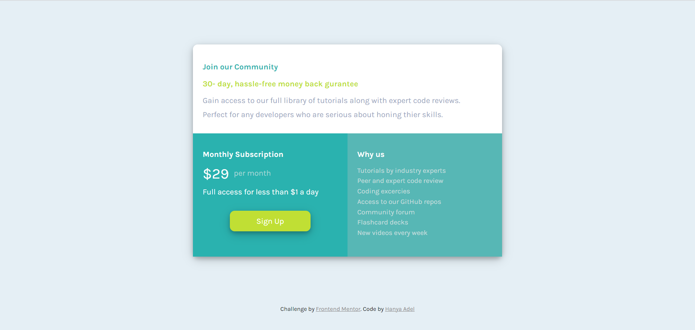

# Frontend Mentor - Single price grid component solution

This is a solution to the [Single price grid component challenge on Frontend Mentor](https://www.frontendmentor.io/challenges/single-price-grid-component-5ce41129d0ff452fec5abbbc).

## Table of contents

- [Overview](#overview)
  - [The challenge](#the-challenge)
  - [Screenshot](#screenshot)
  - [Links](#links)
- [My process](#my-process)
  - [Built with](#built-with)
- [Author](#author)

## Overview

### The challenge

Users should be able to:

- View the optimal layout for the component depending on their device's screen size
- See a hover state on desktop for the Sign Up call-to-action

### Screenshot

Desktop Layout 

Mobile Layout  

### Links

- Solution URL: <a href="https://github.com/HanyaAdel/Single-price-grid-component/" target="_new"> Github repository</a>
- Live Site URL: <a href="https://hanyaadel.github.io/Single-price-grid-component/" target="_new"> Demo</a>

## My process

### Built with

- HTML5 markup
- CSS
- Flexbox

## Author

- Linkedin - [Hanya Adel](https://www.linkedin.com/in/hanya-e-720149138/)
